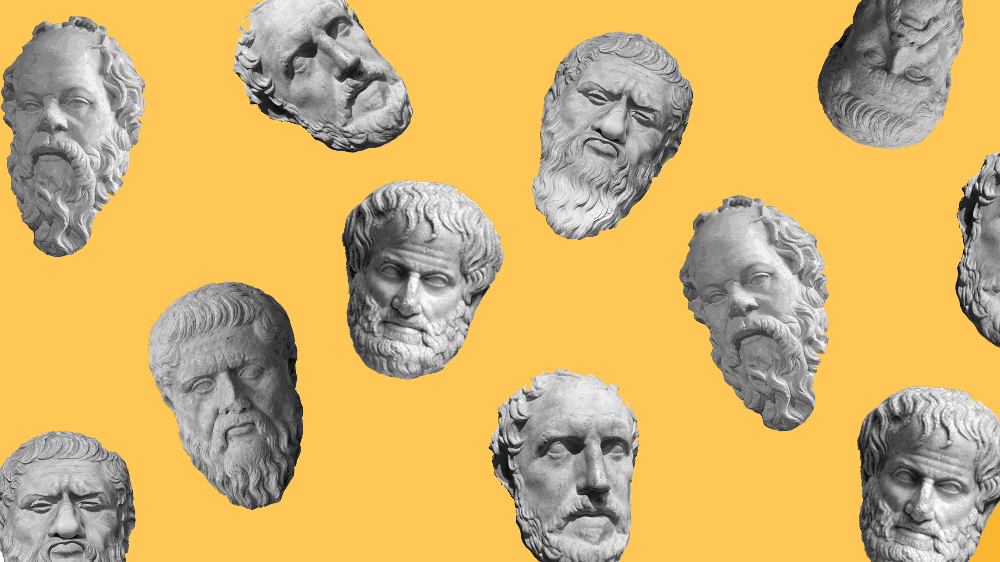

# Applied Data Science @ Columbia
## Spring 2022
## Project 1: A "data story" on the history of philosophy



### [Project Description](doc/)


Term: Spring 2022

+ Project title: Deep dive into Philosophers and their schools of thought.
+ This project is conducted by Vaishak Naik

+ Project summary: The main aim of this project is to deep dive into the different schools of thought, what words each school of thought emphasizes, and what sentiment is emphasized in each school of thought. This report is created based on the [Philosophy Data Project](http://www.philosophydata.com/) dataset. The dataset consists of more than 300 thousand sentences and 13 schools of thought.
This folder is organized as follows.

```
proj/
├── lib/
├── data/
├── doc/
├── figs/
└── output/
```

Please see each subfolder for a README file.
